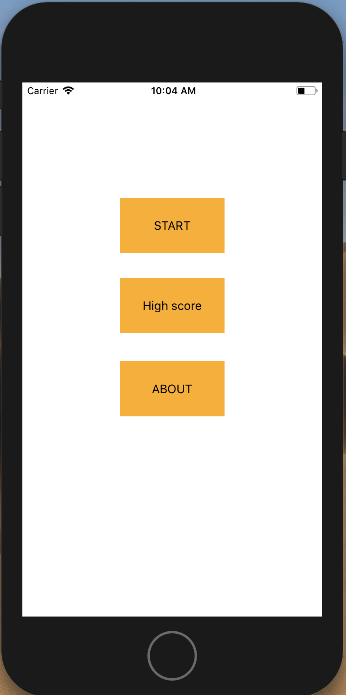
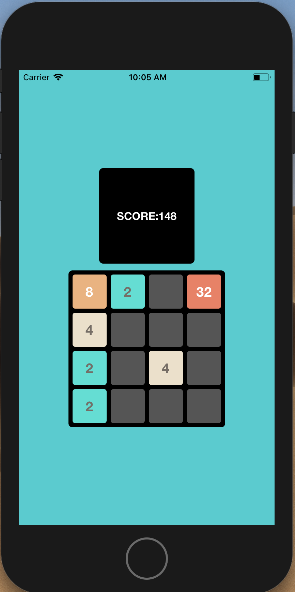

2048-ios
========

Intro:
------
We all know the famous 2048 game this game attempts to make the 2048 but there is a slight twist. As the original 2048 
can be tricked by swiping just left and then up repetedly. This version dont move tiles to extreme if they dont match,
which makes this game a bit more challenging. 

Prerequisites:
--------------
Requires Xcode or any other IDE that can open .swift files (Using Xcode is recommended)

Installing:
-----------
In order to install the project clone the project to your computer by typing this command  

`git clone https://github.com/yashpatel007/2048-ios.git`

in your native machine terminal. You can open the project using Xcode only as this project is written in swift language

Working Screen Shots:
---------------------

